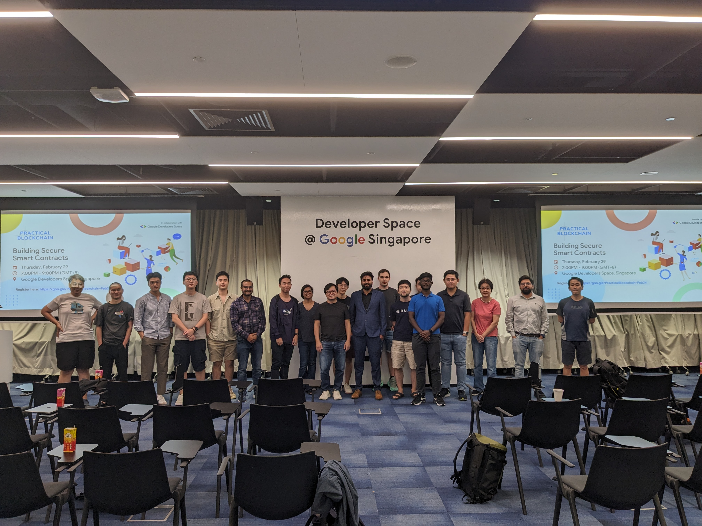

# Smart Contract & Blockchain Security

## Description & Agenda

Join us for an insightful, in-depth talk on smart contract and blockchain security by Mohit Vashistha from Aelf. We'll explore key topics including smart contract fundamentals, blockchain security measures, real-world incidents, vulnerability mitigation strategies, and best practices for secure development.

Agenda
7.00pm - 7.30pm: Registration, networking
7.30pm - 8.45pm: Smart Contract Security Fundamentals by Mohit Vashistha, Blockchain & Zero Knowledge Proof (ZKP) Researcher at Aelf
8.45pm - 9.00pm: QnA / Networking

Snacks and drinks have been graciously sponsored by Aelf.

Whether you are a developer, a blockchain enthusiast, or simply curious about smart contract security, this event is designed to cater to all skill levels. Come connect, learn, and network with fellow blockchain enthusiasts who are passionate about building a secure future on the blockchain.

## Slides, Notes, Code & Resources

To be updated
